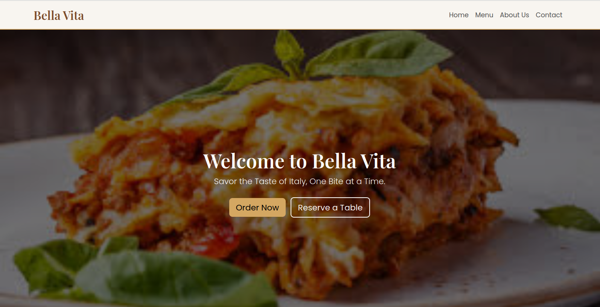
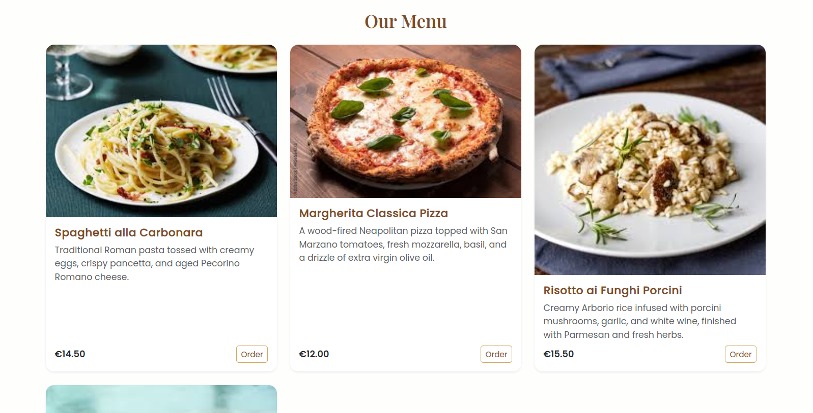
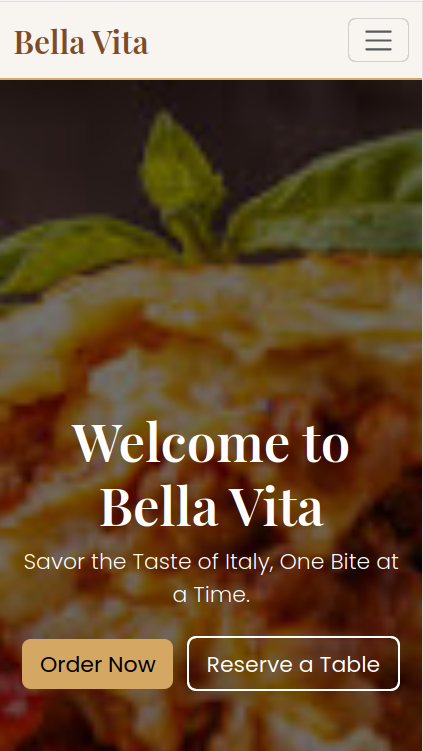
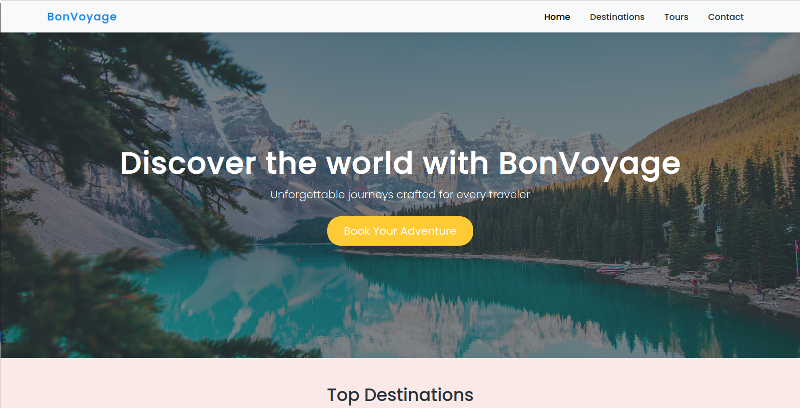
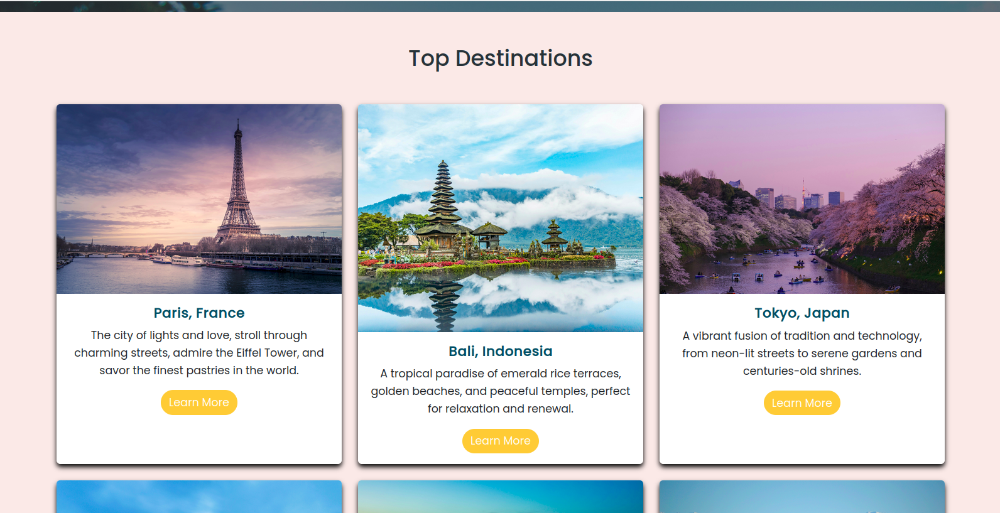
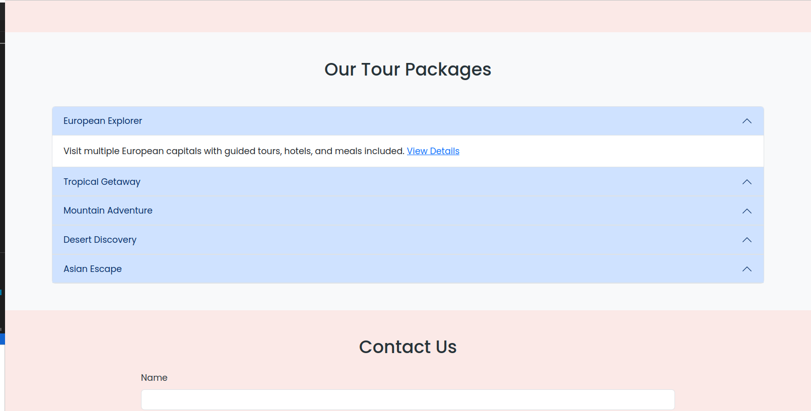
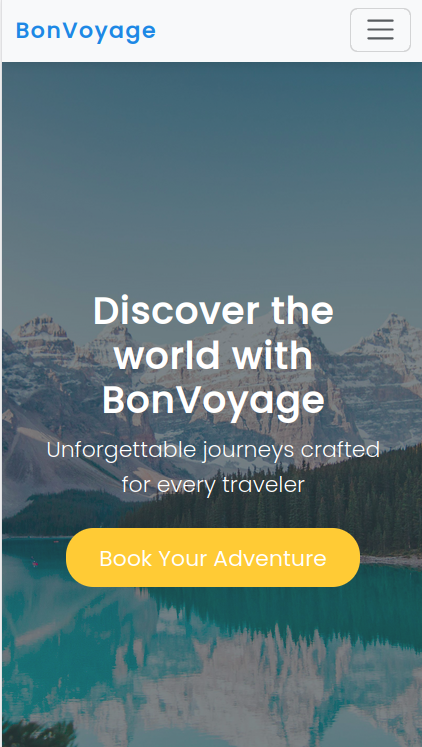
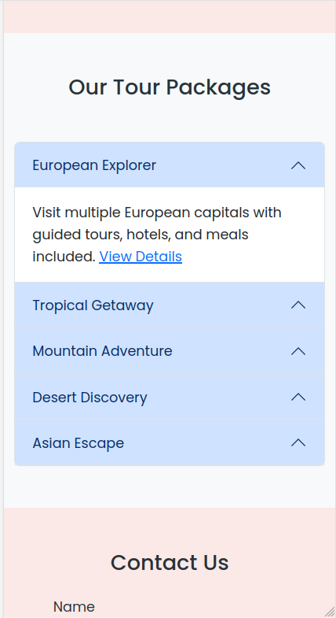

# Web Design Projects — HTML & CSS / Bootstrap

This repository contains two creative front-end projects designed to showcase responsive layouts and visual design skills using **HTML**, **CSS**, and **Bootstrap**.

---

## Project 1: Bella Vita (Restaurant Website)

### Overview

**Bella Vita** is a fictional Italian restaurant website built with HTML, CSS, and Bottstrap only.  
It features a simple and elegant design highlighting the restaurant’s ambiance, menu, and story.

### Features

- Custom navigation bar
- Hero section
- Menu section with four Italian dishes
- “About Us” section with restaurant story and style
- Fully responsive layout

### Screenshots

### Technologies

- HTML5
- CSS3 (Flexbox, gradients, hover effects)
- Bootstrap
- Google Fonts (Playfair Display, Lato)

---

## Project 2: BonVoyage Travel Agency (Bootstrap Landing Page)

### Overview

**BonVoyage Travel Agency** is a responsive landing page built with **Bootstrap 5**, designed to inspire users to explore beautiful destinations around the world.

### Features

- Responsive Navbar (Home, Destinations, Tours, Contact)
- Hero Section with scenic background
- Grid of six travel destinations using Bootstrap Cards
- Accordion-style Tour Packages
- Contact Form with Bootstrap components
- Footer with social icons

### Screenshots

